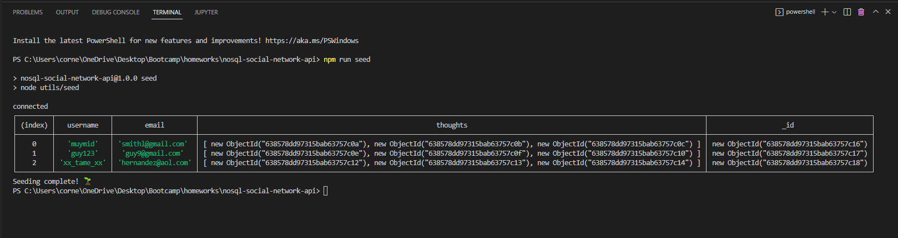
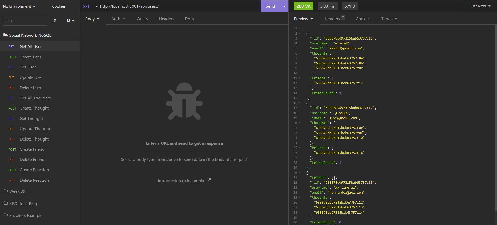
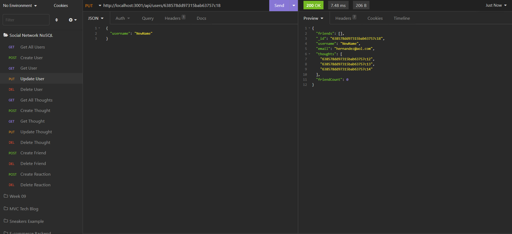
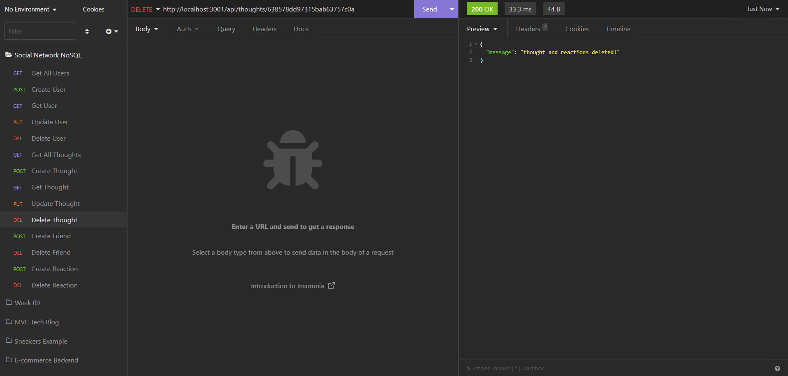

# NoSQL Social Network Backend


## User Story

```md
AS A social media startup
I WANT an API for my social network that uses a NoSQL database
SO THAT my website can handle large amounts of unstructured data
```

## Description

A mock social network backend API created using MongoDB, Mongoose.js, and Express.js. This server uses mongoDB for database storage, mongoose schemas to create models, and express API endpoints to achieve full CRUD functionality. Furthermore, this application leverages mongoose virtuals, getters, and validation for strict data-entry control. This application also meets the following acceptance criteria:

```md
GIVEN a social network API
WHEN I enter the command to invoke the application
THEN my server is started and the Mongoose models are synced to the MongoDB database
WHEN I open API GET routes in Insomnia for users and thoughts
THEN the data for each of these routes is displayed in a formatted JSON
WHEN I test API POST, PUT, and DELETE routes in Insomnia
THEN I am able to successfully create, update, and delete users and thoughts in my database
WHEN I test API POST and DELETE routes in Insomnia
THEN I am able to successfully create and delete reactions to thoughts and add and remove friends to a user’s friend list
```

Seeding the data looks as follows:



A GET example looks as follows:



A PUT example looks as follows:



A DELETE example looks as follows:



The following link leads to a demonstration of the application being used:

User routes: https://watch.screencastify.com/v/k3OohgQUa5IbtnEWZUvY

Thought routes: https://watch.screencastify.com/v/shfMpNmY8uqO82MqEd7z

Friend/Reaction routes: https://watch.screencastify.com/v/juJypPnS6JNBe9PUgD4l

Bonus: https://watch.screencastify.com/v/VODp4l4PdbJHi05yhjh8

## Table of Contents

- [Installation](#installation)
- [Usage](#usage)
- [Credits](#credits)
- [Contribute](#contribute)
- [Tests](#tests)
- [Questions](#questions)
- [License](#license)

## Installation

MongoDB needs to be installed locally to run this application. Installation documentation can be found at: https://www.mongodb.com/home

Furthermore, the following packages need to be installed in order to run the application:

Mongoose: https://mongoosejs.com/

Express: https://www.npmjs.com/package/express

These packages can be installed using the command:

```md
npm i
```

## Usage

This program can be downloaded and used by anyone. To run the application, use the following commands:

First, follow the installation steps listed above. Once the installation is done, seed and run the application by running the following commands:

```md
npm run seed
npm run start
```

Finally, the endpoints can be reached locally through localhost and the port option of 3001 using an API client (like Insomnia or Postman):

http://localhost:3001/

The followings routes exist:

For GET and POST requests to the thoughts endpoint: http://localhost:3001/api/thoughts

For GET, PUT and DELETE requests to the individual thought endpoint: http://localhost:3001/api/thoughts/:thoughtId

For POST requests to the thought's reaction endpoint: http://localhost:3001/api/thoughts/:thoughtId/reactions

For DELETE requests to the thought's individual reaction endpoint: http://localhost:3001/api/thoughts/:thoughtId/reactions/:reactionId

For GET and POST requests to the users endpoint: http://localhost:3001/api/users

For GET, PUT and DELETE requests to the individual user endpoint: http://localhost:3001/api/users/:userId

For POST and DELETE requests to the user's friends endpoint: http://localhost:3001/api/users/:userId/friends/:friendId

## Credits

This following libraries/frameworks/databases are credited with helping create this application:

MongoDB is a cross-platform document-oriented database program: https://www.mongodb.com/home

Mongoose is used as a javaScript object-oriented library that creates a connection between MongoDB and Node.js: https://mongoosejs.com/

Express is used as a web routing framework: https://www.npmjs.com/package/express

## Contribute

This is a completed application and does not need any contributions.

## Tests

There is no testing for this application.

## Questions

Feel free to reach out to me with questions:

Find my GitHub at: [GitHub Profile](https://github.com/cornetj13)

Email me at: cornetj2@gmail.com

## License

This source code is licensed under the MIT license found in the LICENSE file in the root directory of this source tree.
